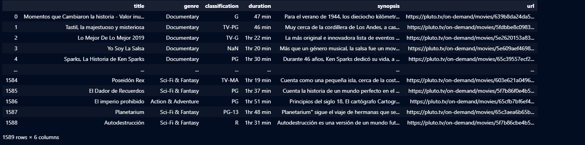
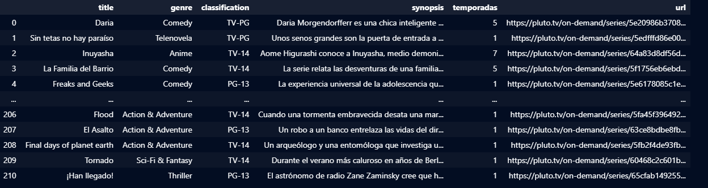
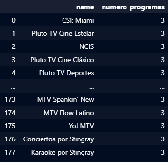

# Prueba Técnica 


## **Tabla de Contenidos**

- [Introducción](#introducción)
- [Desarrollo](#desarrollo)
- [Instalación](#instalación)
- [Conclusión](#conclusión)
- [Contacto](#contacto)

## **Tecnolgías usadas**


---

# Introducción

A continuación, se explicará el proyecto realizado para la prueba técnica. El objetivo era hacer web scraping en la página de Pluto TV, y extraer todas las películas y series junto a su metadata, así como todos los canales.

Es un plus obtener más datos de cada sección, como episodios por serie y grilla de canales, que el código se ejecute en menos de 2 horas, identificar modelos de negocio y hacer análisis y/o procesamiento de los datos.


---

# Desarrollo


Para esto, se ha usado la librería **`Playwright`**, que permite hacer scraping en sitios web flexibles e interactivos, lo cual fue esencial para realizar esta tarea. También, para lograr la mayor optimización del tiempo de scraping, se utilizó la librería de Python base **`concurrentt`**, que me permitió trabajar en hilos y cargar conjuntamente muchas películas y series.

### Entorno de codigo

El script principal que ejecuta todo el proceso es [scrapping.py](./scrapping.py),este se encarga de realizar las siguientes tareas:
- **`realizar la obtención de series y peliculas`**: Para en la carpeta [scripts](./scripts/), estan todos los scripts necesarios para realizar esas tareas:
    - [init_pluto_tv.py](./scripts/init_pluto_tv.py) : Inicia Playwright y abre un enlace
    - [get_series_demand.py](./scripts/get_on_demand.py) : Con pluto iniciado va a la seccion On Demand, y obtiene los enlaces de todas las series y películas.

    - [get_series_movies.py](./scripts/get_series_movies.py) : Para cada serie y película, guarda las peliculas en un csv y las series con sus episodios en un json.

    - [get_channels](./scripts/get_channels_programs.py.py) : Obtiene todos los canales sus url, y los programas mas proximos junto a su horario de transmisión y se guardan en un formato json.
- **`Monitorear el tiempo de ejecución`**:  Para cada proceso realizado, se imprime el tiempo que tardó en ejecutarse, lo que permite tener un mejor control y conocer qué secciones optimizar.


Finalmente se guardaron los datos en la carpeta [database](./database), la cual contiene:
- [**`movies.csv `**](./database/movies.csv): Una tabla con las peliculas y su metadata.
- [**`series.json`**](./database/series.json): Un json con las series y su metadata los episodios de cada serie y sus metadatas
- [**`channels.json`**](./database/channels.json): Un json con la información de un cada canal, y la grilla de los programas mas próximos.
# 🛠️ Instalación

## 1. Primero clona el repositorio.
```bash
git clone https://github.com/brunozenobio/bb_media_test.git
```
## 2. Muevete al directorio del repositorio.

```bash
cd  bb_media_test
```
## 3. Luego crea un entorno de python.
Ejemplo.
```bash
python -m venv myvenv
```
## 4. Inicia el entorno

🔹 En Linux/Mac:
```bash
source myvenv/bin/activate
```
Windows

🔹 En Windows:
```bash
myvenv/Scripts/activate
```
## 5. Luego instala el archivo requirements para tener las librerias necesarias.
```bash
pip install -r requirements.txt
```
## 6. Luego instala playwright
```bash
playwright install
```
## 7.Finalmente ejecuta el script
```bash
python scrapping.py  > output.txt
```

# Conclusiones y Resultados

El modelo de negocios de Pluto TV se basa principalmente en los anuncios pagados, los cuales, al ser un servicio de streaming gratuito, pueden llegar a una gran cantidad de espectadores.

Además, Pluto TV colabora con distintos productores para obtener los derechos de transmisión de contenidos.

En el archivo output.txt se puede ver el tiempo demorado en cada ejecución:
```bash
Tiempo total de ejecución:  1.98 horas
```

Este fue posible, gracias a la optimización lograda trabajando con multiprocesos.

### Peliculas:


Se obtuvo un total de 1799 peliculas y un total de 23 generos

### Series:

Se obtuvo un total de 210 series con 18 generos.

La serie con mayor cantidad de temporadas es South Park con 25 temporadas.

### Top 10 series con mayor cantididad de episodios.


### Canales


Se obtuvo un total de 178 canales 


## Contacto

<div style="display: flex; align-items: center;">
  <a href="https://www.linkedin.com/in/brunozenobio/" style="margin-right: 10px;">
    
  </a>
  <a href="mailto:brunozenobio4@gmail.com" style="margin-right: 10px;">
    
  </a>
</div>
